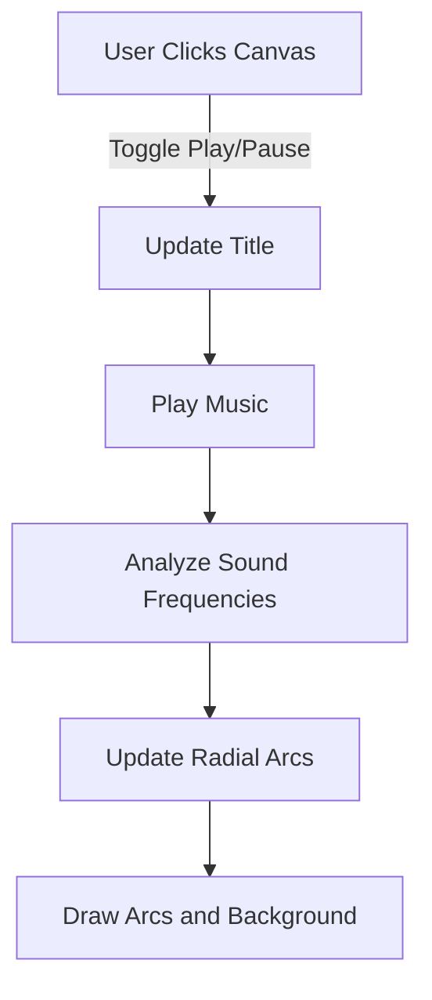

# 🎧 Visual Audio Player

Welcome to the **Visual Audio Player** project! This interactive visualizer pairs audio with dynamic radial arcs and a rotating album title. Built using p5.js, this project allows you to visualize sound in real-time with a colorful and immersive interface.

## 🌟 Features

- **🎶 Sound Visualization**: Radial arcs that respond to bass and treble frequencies.
- **🔊 Album Title Animation**: A rotating album title that changes with the audio.
- **🖼️ Dynamic Background**: Background color adapts based on the audio’s energy.

## 🖼️ Interface Overview


### 1. **Radial Arcs**
   - The arcs represent the bass and treble frequencies of the music.
   - As the music plays, the arcs expand and contract, visualizing the energy of different frequencies.

### 2. **Rotating Album Title**
   - The album title is displayed in the center of the screen, rotating to the rhythm of the music.
   - The title changes dynamically based on the state of the music.

### 3. **Interactive Canvas**
   - Click on the canvas to play or pause the music. The title changes when the music plays.

## 🛠️ How It Works

### Setup and Preload

The project uses p5.js for rendering visuals and p5.sound for handling audio. Upon loading, the font and audio assets are preloaded to ensure smooth operation.

```javascript
function preload() {
  font = loadFont('assets/Limelight-Regular.ttf');
  soundFormats('mp3');
  soundFile = loadSound('assets/EchoSaxEnd.mp3');
  album_title = "Play";
}
```

### Drawing the Visuals

The `draw` function constantly updates the canvas, creating the dynamic background, rotating the title, and visualizing the audio with radial arcs.

```javascript
function draw() {
  let amplitude = fft.getEnergy("bass") + fft.getEnergy("treble");
  amplitude /= 2;

  let hue = map(amplitude, 0, 255 * 2, 250, 360);
  background(hue, 100, 25);

  if (soundFile) {
    analyseSound();
    updateRadialArcs();
    drawRadialArcs();
  }

  translate(windowWidth / 2, windowHeight / 2); 
  rotate(rotationAngle);
  fill(255);
  stroke(15);
  strokeWeight(10);
  text(album_title, 0, 0);
  textSize(25);
}
```

### Radial Arcs

#### 🎵 Sound Data Visualization
The `RadialArcs` and `RadialArc` classes manage the visual representation of sound frequencies. Bass and treble are visualized as expanding and contracting arcs.

```javascript
class RadialArc { 
  // properties initialization
  constructor(id, arcs, minR, maxR, baseR, maxStr, minH, maxH) {
    //...
  }

  // Update and redraw the arc based on data
  redrawFromData() {
    this.updateArc();
    this.drawArc(); 
  }
}
```

### User Interaction

Clicking on the canvas toggles the playback of the sound file. The title changes when the music plays, adding an interactive element to the visual experience.

```javascript
function togglePlay() {
  if (soundFile.isPlaying()) {
    soundFile.pause();
    soundFile.setVolume(0);
  } else {
    album_title = "Epic Sax";
    soundFile.setVolume(1, 4, 0);
    soundFile.loop();
  }
}
```

## 📊 Flow Diagram



## 🚀 Getting Started

### Prerequisites

- [p5.js](https://p5js.org/)
- [p5.sound](https://p5js.org/reference/#/libraries/p5.sound)

### Installation

1. Clone the repository:

   ```bash
   git clone https://github.com/William-Laverty/Audio-Visualiser.git
   ```

2. Open `index.html` in your web browser.

3. Click to play and enjoy the visual experience!

## 📚 Documentation

- [p5.js Documentation](https://p5js.org/reference/)
- [p5.sound Documentation](https://p5js.org/reference/#/libraries/p5.sound)

## 📝 License

This project is licensed under the MIT License - see the [LICENSE](https://github.com/William-Laverty/Audio-Visualiser/blob/main/LICENSE) file for details.

## 💬 Feedback

Feel free to open an issue if you encounter any bugs or have feature requests! Contributions are always welcome.

---

Enjoy the music and visuals! 🎵
